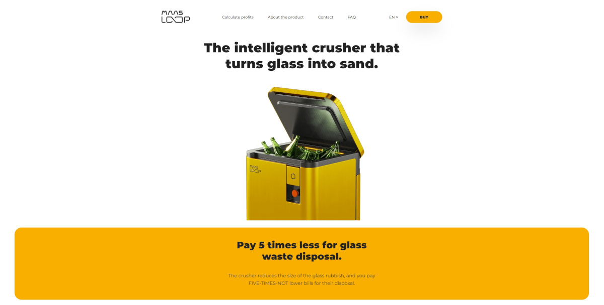

# mass-loop

Mass Loop project it was my interview task for Blue Paprica. My job was to create website app based on Figma file.
Website had working language switcher, calculator, sticky navigation & nav burger menu. For styling I used preprocessor Sass and RWD technique with Mobile First approach.

## See it live

-   [GitHub Pages](https://github.com/mate966/mass-loop)
-   [Live Site](https://mate966.github.io/mass-loop/)

## Built With

-   [Javascript](https://developer.mozilla.org/pl/docs/Web/JavaScript)
-   [SASS](https://sass-lang.com/)
-   [BEM](http://getbem.com/)
-   [AOS Css](https://michalsnik.github.io/aos/) - Animate on scroll library
-   [i18next](https://www.i18next.com/) - Site translate framework
-   [React Responsive](https://www.npmjs.com/package/react-responsive) - React media queries

## Author

-   **Mateusz Szweda** - [Mate](https://github.com/mate966)
-   **Blue Paprica** - [Blue Paprica](https://bluepaprica.com/)
